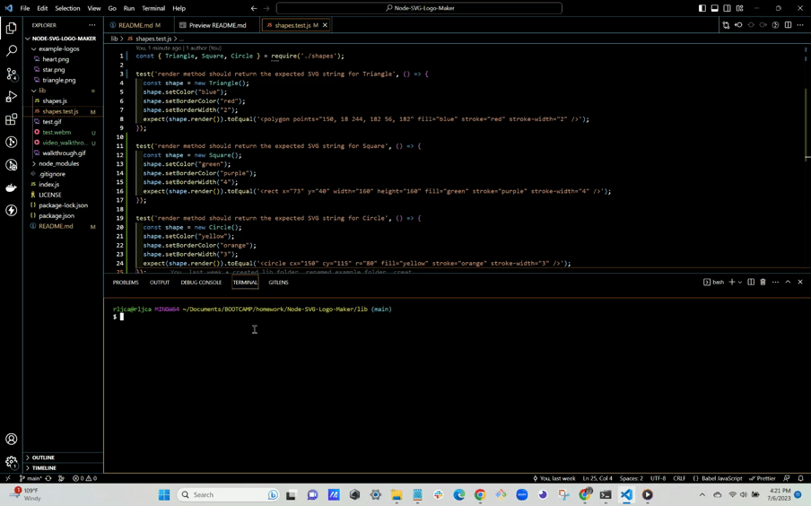

# Module 10 Challenge: Node SVG Logo Maker

## Table of Contents

 * [Description](#description)

 * [Technologies-Used](#technologies-used)

  * [Installation](#installation)

 * [Test-Instructions](#test-instructions)
 
  * [Examples of Generated Logos](#examples-of-generated-logos)

 * [Live-Screen-Recording-of-Application-Functionality](#live-screen-recording-of-application-functionality)

 * [License](#license)

 * [Contact-Info](#contact-info)

## Description

This application is a Node.js command-line application that takes in user input to generate a logo and save it as an SVG file to an external site. The application prompts the user to enter up to three characters, then select a color, shape and border for the logo, and saves the generated SVG to a "logo.svg" file. Future development on this application will be adding more polygons and font styles for users to choose from.   
 
## Technologies Used

   -  Javascript
   -  Node.js v16
   -  Inquirer v8.2.4
   -  Jest v29.5.0 

 

## Installation

1. Clone the repo in the command line with:
   git clone git@github.com:WHT-RBT/Node-SVG-Logo-Maker.git

2. Open in VS Code using the command:  code .

3. Install node.js v16

4. In the terminal use command: 
   npm init -y to create your package.json files

5. Use the terminal to run the command: 
   npm i to install the dependencies 

6. Use the terminal to run the command: 
   npm i inquirer@8.2.4 to install v8.2 4 of inquirer

7. Use the terminal to run the command: 
   npm i jest to install the latest version of jest

8. Use the terminal to run the index.js file using the command: 
   node index.js, then follow the prompts to create your logo

 

## Testing

Below is video of the test ran using the command npm run test checking for use of a render() method.

 

## Examples of Generated Logos

 
 

## Live Screen Recording of Application in Use

 

## License

NOTICE: This application is covered under the MIT License

 

## Contact Info

Use the links below to reach me through GitHub or by email:

[Github Link](https://github.com/WHT-RBT)

<a href="mailto:the.whiterabbit@yahoo.com">Email me 🐇</a>